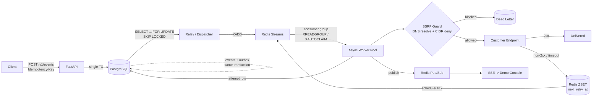

# Relay

<!--
  Demo GIF placeholder (backlog-p6-11, not yet recorded -- requires a real screen
  capture, which is out of scope for this pass). When it exists, it belongs at:
    docs/assets/demo.gif
  and should replace this comment with:
    
  It should show ~20 seconds of the "Delivery Theater" console: start a sandbox,
  register the always-500 mock receiver, trigger an event, and watch the attempt
  timeline show retries, the breaker trip, and the DLQ fill.
-->

**[Demo GIF placeholder -- see `docs/assets/demo.gif` note in the source of this file. Not
recorded yet.]**



A webhook delivery service: tenants register HTTPS endpoints, subscribe to event types, and POST
events; Relay durably fans them out with at-least-once delivery, HMAC signing, jittered retry
backoff, per-endpoint circuit breakers, and a replayable dead-letter queue.

**[docs/guarantees.md](docs/guarantees.md)** states exactly what this promises -- and exactly
where each promise stops -- and is the highest-signal page in this repo if you only read one.
[docs/failure-modes.md](docs/failure-modes.md) is the running "if it dies here, then what, and
which test proves it" log behind those promises. [docs/runbook.md](docs/runbook.md) covers
deploy, rollback, and DLQ replay. [RELAY-PLAN.md](../RELAY-PLAN.md) has the full build-phase plan.

**Status:** Phases 0–5 (skeleton, API/domain, delivery engine, security & resilience, the
public demo console, and observability/ops) are complete in code, and Phase 6's load-test
harness and tooling hardening (this branch) are landing on top; see
[docs/PROJECT_STATUS.md](docs/PROJECT_STATUS.md) for what's deployed right now versus what's
only landed on a feature branch.

## Architecture notes

`api → services → repositories → infra` (plus `workers`, a sibling of `api`, for the delivery
engine's background processes) is the enforced layering, checked by `import-linter` in CI;
`domain` depends on nothing. `/healthz` is a liveness check with no dependencies; `/readyz`
checks Postgres and Redis independently and returns a per-dependency breakdown, which is what
the deploy pipeline polls after every swap. Every process logs structured JSON to stdout
(`relay.infra.logging`) and a single correlation id ties an API request to every worker log
line produced while delivering the event it created — see
[docs/adr/0007-phase-5-observability-and-ops.md](docs/adr/0007-phase-5-observability-and-ops.md).
Locally, Caddy reverse-proxies to the API over plain HTTP (`docker/compose.yml`). In production,
TLS and routing are handled by a Traefik instance already running on the deploy VPS (shared with
other services on that box) via Docker labels on the `api` container — see
`docs/adr/0002-shared-vps-traefik.md` for why that differs from the local setup.

## Local setup

```bash
uv sync              # install deps into .venv
cp .env.example .env # see below for what each var does
make up               # docker compose: postgres, redis, api, caddy
make migrate          # alembic upgrade head
make test             # unit + integration (integration spins up its own
                       # throwaway Postgres/Redis via testcontainers)
make lint              # ruff check + format --check
make typecheck          # mypy --strict src
```

Open `http://localhost:8000/docs` for the interactive OpenAPI, or `http://localhost:8080/readyz`
to hit the same API through the local Caddy proxy.

## Load testing

`tests/load/` holds a k6 harness (`events_ingest.js`) plus a fixture-provisioning script
(`scripts/load_test_setup.py`) and a matrix orchestrator (`tests/load/run_matrix.sh`) for
sweeping the plan's performance axes (worker count x concurrent destinations x destination
health). See [tests/load/README.md](tests/load/README.md) for how to run a single cell or the
full matrix, and why the setup script provisions a tenant directly rather than via the public
sandbox. Publishing the swept results in `docs/load-test-results.md` is separate, later work.

## Environment variables

Documented in [.env.example](.env.example) — copy it to `.env` before running anything. Summary:

| Variable | Purpose |
| --- | --- |
| `ENV` | Deployment environment label (`local`, `ci`, `staging`, `production`) |
| `LOG_LEVEL` | Log verbosity |
| `DATABASE_URL` | Async Postgres connection string (`asyncpg` driver) |
| `REDIS_URL` | Redis connection string |
| `API_PORT` | Port the API listens on inside its container |
| `DISPATCHER_METRICS_PORT` | Port the dispatcher's own Prometheus exporter listens on |
| `BACKUP_S3_BUCKET` / `BACKUP_S3_PREFIX` / `BACKUP_S3_ENDPOINT_URL` | Nightly backup destination (see `docs/runbook.md`) |

The full list, including Phase 2–5 worker/security/sandbox/observability tuning, is in
[.env.example](.env.example) with a comment on every variable.

## Observability

`GET /metrics` (api) and `GET :9100/metrics` (the dispatcher's own exporter) serve Prometheus
text exposition — see [docs/runbook.md](docs/runbook.md)'s Observability section for exactly
what each one carries and why there are two targets instead of one.

## Docker image

Multi-stage build (`docker/Dockerfile`): a `uv`-based builder stage produces a `.venv`, the
runtime stage copies only that venv plus `src/`, runs as a non-root user, supports a read-only
root filesystem, and pins its base image by digest.

```bash
docker build -f docker/Dockerfile -t relay:latest .
```

Final runtime image size: **320MB** (`python:3.12-slim` base), measured via `docker images`
after a clean `make build`.

## Known limitations

See [docs/guarantees.md](docs/guarantees.md)'s "Not guaranteed" section and
[RELAY-PLAN.md](../RELAY-PLAN.md)'s scope-discipline notes for the full, honest list
(no ordering, no global fairness, DNS rebinding mitigated but not eliminated, etc.). A few
worth calling out here specifically:

<<<<<<< HEAD
=======
- No nightly backup/restore — Phase 5 (optional) scope, not yet started.
>>>>>>> 41b5690 (docs: restructure README to open with diagram, record image size)
- The VPS egress firewall rules documented in `docs/runbook.md` as defense-in-depth behind
  the application-layer SSRF guard have not been applied to the production VPS yet (it's
  shared with other pre-existing services, so this needs deliberate coordination, not
  unilateral automation).
<<<<<<< HEAD
- `GET /metrics` is unauthenticated and not restricted at the network layer in production —
  same reasoning and same "not this repo's tooling's call to make unilaterally" as the
  egress-firewall rules above.
- The nightly-backup systemd timer (`scripts/systemd/`) is written and documented but not
  yet installed on the production VPS — the backup/restore *scripts* have been actually run
  and verified (see `docs/PROJECT_STATUS.md`), just not yet on an automated schedule there.
- No Grafana dashboard, no Sentry, no k6 load-test numbers yet — explicitly nice-to-have or
  Phase 6 scope per the project plan, not oversights.
=======
- The Phase 6 load-test matrix (worker count x destinations x health profile) has reusable
  tooling (`tests/load/`) but has not yet been run end-to-end and published in
  `docs/load-test-results.md`.
>>>>>>> 41b5690 (docs: restructure README to open with diagram, record image size)
